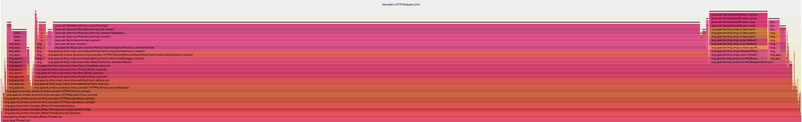

# Apache.Benchmark.NG

## Описание окружения

Ноутбук Dell Insperion 17 5000 Series


Процессор Intel Core i7 с 4-мя ядрами по 800 МГц,
отключенным гипетрейдингом и отключенным пониженным энергопотреблением.
Настройки энергосбережения скорректированы для на максимальной
производительности.

    lscpu
    Архитектура:         x86_64
    CPU op-mode(s):      32-bit, 64-bit
    Порядок байт:        Little Endian
    CPU(s):              4
    On-line CPU(s) list: 0-3
    Потоков на ядро:     1
    Ядер на сокет:       4
    Сокетов:             1
    NUMA node(s):        1
    ID прроизводителя:   GenuineIntel
    Семейство ЦПУ:       6
    Модель:              142
    Имя модели:          Intel(R) Core(TM) i7-8550U CPU @ 1.80GHz
    Степпинг:            10
    CPU МГц:             800.036
    CPU max MHz:         1800,0000
    CPU min MHz:         400,0000
    BogoMIPS:            3984.00
    Виртуализация:       VT-x
    L1d cache:           32K
    L1i cache:           32K
    L2 cache:            256K
    L3 cache:            8192K
    NUMA node0 CPU(s):   0-3
    Флаги:               fpu vme de pse tsc msr pae mce cx8 apic sep mtrr pge mca cmov pat pse36 clflush dts acpi mmx fxsr sse sse2 ss ht tm pbe syscall nx pdpe1gb rdtscp lm constant_tsc art arch_perfmon pebs bts rep_good nopl xtopology nonstop_tsc cpuid aperfmperf tsc_known_freq pni pclmulqdq dtes64 monitor ds_cpl vmx est tm2 ssse3 sdbg fma cx16 xtpr pdcm pcid sse4_1 sse4_2 x2apic movbe popcnt tsc_deadline_timer aes xsave avx f16c rdrand lahf_lm abm 3dnowprefetch cpuid_fault epb invpcid_single pti ssbd ibrs ibpb stibp tpr_shadow vnmi flexpriority ept vpid fsgsbase tsc_adjust bmi1 avx2 smep bmi2 erms invpcid mpx rdseed adx smap clflushopt intel_pt xsaveopt xsavec xgetbv1 xsaves dtherm arat pln pts hwp hwp_notify hwp_act_window hwp_epp flush_l1d

Операционная система Ubuntu Linux:

    uname -a
    Linux notebook 4.15.0-46-generic #49-Ubuntu SMP Wed Feb 6 09:33:07 UTC 2019 x86_64 x86_64 x86_64 GNU/Linux


Java 8 от Oracle:

    java -version
    java version "1.8.0_181"
    Java(TM) SE Runtime Environment (build 1.8.0_181-b13)
    Java HotSpot(TM) 64-Bit Server VM (build 25.181-b13, mixed mode)


maven 3.5.2:

    mvn -version
    Apache Maven 3.5.2
    Maven home: /usr/share/maven
    Java version: 1.8.0_181, vendor: Oracle Corporation
    Java home: /usr/lib/jvm/java-8-oracle/jre
    Default locale: ru_RU, platform encoding: UTF-8
    OS name: "linux", version: "4.15.0-46-generic", arch: "amd64", family: "unix"


JMeter maven plugin 2.8.6:

    <groupId>com.lazerycode.jmeter</groupId>
    <artifactId>jmeter-maven-plugin</artifactId>
    <version>2.8.6</version>

Apache.JMeter 5.1.1:

    <jmeterVersion>5.1.1</jmeterVersion>

## Maven profiles description

### Samplers

##### Flow Control Action

Pause 0 second
Duration: 0 second
Для любого количества итераций

Для Flow Control Action:
* работают:
    - PreProcessors
    - Timers
* не работают:
    - PostProcessors


Pause 1 ms

###### 60 000 итераций для 50 потоков

`mvn jmeter:jmeter -P Samplers.Flow.Control.Action -D test.LoopCount=60000`

67068 ms = 60 000 ms + 7068 ms

    Starting the test @ Fri Apr 12 21:14:40 MSK 2019 (1555092880650)
    Tidying up ...    @ Fri Apr 12 21:15:47 MSK 2019 (1555092947718)

67336 ms = 60 000 ms + 7336 ms

    Starting the test @ Fri Apr 12 21:16:06 MSK 2019 (1555092966973)
    Tidying up ...    @ Fri Apr 12 21:17:14 MSK 2019 (1555093034309)

67692 ms = 60 000 ms + 7692 ms

    Starting the test @ Fri Apr 12 21:20:56 MSK 2019 (1555093256038)
    Tidying up ...    @ Fri Apr 12 21:22:03 MSK 2019 (1555093323730)


###### 120 000 итераций для 50 потоков

`mvn jmeter:jmeter -P Samplers.Flow.Control.Action -D test.LoopCount=120000`
120 000 итераций для 50 потоков - длительность 120 сек + 17 сек на тест
120 000 итераций для 50 потоков - длительность 120 сек + 14 сек на тест

###### 180 000 итераций для 50 потоков

`mvn jmeter:jmeter -P Samplers.Flow.Control.Action -D test.LoopCount=180000`

200266 ms = 180 000 ms + 20 266 ms

    Starting the test @ Fri Apr 12 21:22:53 MSK 2019 (1555093373703)
    Tidying up ...    @ Fri Apr 12 21:26:13 MSK 2019 (1555093573969)

200056 ms = 180 000 ms + 20 056 ms

    Starting the test @ Fri Apr 12 21:32:20 MSK 2019 (1555093940205)
    Tidying up ...    @ Fri Apr 12 21:35:40 MSK 2019 (1555094140261)

199987 ms = 180 000 ms + 19 987 ms

    Starting the test @ Fri Apr 12 21:37:50 MSK 2019 (1555094270110)
    Tidying up ...    @ Fri Apr 12 21:41:10 MSK 2019 (1555094470097)

Утилизация процессора: 120% для Intel Core i7
Утилизация памяти: 256 МБайт

###### 180 000 итераций для 100 потоков

198558 ms = 180 000 ms + 18 558 ms

    Starting the test @ Fri Apr 12 22:29:25 MSK 2019 (1555097365313)
    Tidying up ...    @ Fri Apr 12 22:32:43 MSK 2019 (1555097563871)

Утилизация процессора: 200% для Intel Core i7
Утилизация памяти: 256 МБайт


##### HTTP Request


###### Samplers.HTTP.Request

Два потока. В каждом из которых выполняется 1 HTTP Request, который выполняет GET-запрос к серверу nginx и получает в ответ страницу по умолчанию для nginx.

`mvn jmeter:jmeter -P Samplers.HTTP.Request,_.jmeter.smallResult`

При работе теста результаты мониторинга с помощью htop показывают что процесс java, выполняющий Apache.JMeter работает в два потока. Которые в сумме утилизируют каждый по одному ядру системы.
И большая часть времени утилизации процессора - %system, а не %user.


Результаты нескольких запусков:

Запуск с профилированием sjk:

    summary = 400002 in 00:07:03 =  944.7/s Avg:     2 Min:     0 Max:    86 Err:     0 (0.00%)
    summary = 400002 in 00:07:00 =  951.7/s Avg:     2 Min:     0 Max:   433 Err:     0 (0.00%)
    summary = 400002 in 00:06:56 =  960.9/s Avg:     2 Min:     0 Max:    52 Err:     0 (0.00%)
    summary = 400002 in 00:06:22 = 1047.8/s Avg:     1 Min:     0 Max:    51 Err:     0 (0.00%)
    summary = 400002 in 00:07:12 =  925.3/s Avg:     2 Min:     0 Max:   118 Err:     0 (0.00%)


Получается, примерный результат: 966.08 запросов в сек. Для двух потоков, выполняющих HTTP GET запросы. Один запрос за один цикл тестирования.

При этом профилирование Apache.JMeter с помощью sjk показывает, что узким местом является не обработка запроса тестом, а установка соединения.

Наиболее медленные методы (конечные узлы стек-трейсов, которые были наиболее частыми во время профилирования)

    Trc     (%)  Frm  N  Term    (%)  Frame
    136659  80%  136659  136659  80%  java.net.PlainSocketImpl.socketConnect(Native Method)
     12836   7%  12836    12836   7%  java.net.SocketInputStream.socketRead0(Native Method)
      3207   1%  3207      3207   1%  java.net.PlainSocketImpl.socketShutdown(Native Method)
      2625   1%  2625      2582   1%  java.security.AccessController.doPrivileged(Native Method)
      2425   1%  2425      2425   1%  java.net.SocketOutputStream.socketWrite0(Native Method)
      1546   0%  1546      1546   0%  java.lang.Object.hashCode(Native Method)
       981   0%  981        981   0%  java.net.PlainSocketImpl.socketClose0(Native Method)
       920   0%  920        920   0%  java.net.PlainSocketImpl.socketCreate(Native Method)
      2466   1%  2466       911   0%  java.util.HashMap.hash(HashMap.java:339)
       524   0%  524        523   0%  java.lang.Object.<init>(Object.java:37)
       479   0%  479        479   0%  java.net.PlainSocketImpl.socketSetOption0(Native Method)
       405   0%  555        404   0%  org.apache.jmeter.testelement.AbstractTestElement.recoverRunningVersion(AbstractTestElement.java:514)
       646   0%  646        279   0%  org.apache.http.protocol.ImmutableHttpProcessor.process(ImmutableHttpProcessor.java:133)
       517   0%  517        213   0%  java.util.concurrent.ConcurrentHashMap.put(ConcurrentHashMap.java:1006)
       290   0%  290        205   0%  org.apache.http.impl.BHttpConnectionBase.<init>(BHttpConnectionBase.java:114)
       545   0%  545        202   0%  org.apache.http.impl.conn.DefaultManagedHttpClientConnection.<init>(DefaultManagedHttpClientConnection.java:74)
       201   0%  201        201   0%  java.util.concurrent.ConcurrentHashMap.get(ConcurrentHashMap.java:946)
       166   0%  166        166   0%  java.net.URI$Parser.scan(URI.java:2998)
       121   0%  121        120   0%  java.util.HashMap.getNode(HashMap.java:572)
       104   0%  104        104   0%  org.apache.jmeter.protocol.http.sampler.HTTPSamplerBase.readResponse(HTTPSamplerBase.java:1879)
       102   0%  102        102   0%  java.util.concurrent.ConcurrentHashMap.transfer(ConcurrentHashMap.java:2497)




###### Samplers.HTTP.Request.keepAlive


`mvn jmeter:jmeter -P Samplers.HTTP.Request.keepAlive,_.jmeter.smallResult`

Включение keepAlive для одиночного запроса снижает производительность работы теста. И значительно увеличивает вероятность ошибки SocketException при подключении.

Средняя производительность составила 647.1 запросов в сек.
Доля ошибок составила 26.71%.
Средняя производительность по успешным запросам составила 473,8 запроса в сек.

Таким образом. Включение keepAlive для одиночного запроса снизило производительность работы теста, примерно, в 2 раза.

```
[INFO] Starting the test @ Fri Apr 19 21:35:29 MSK 2019 (1555698929332)
[INFO] Waiting for possible Shutdown/StopTestNow/HeapDump/ThreadDump message on port 4445
[INFO] summary +      2 in 00:00:00 =    7.8/s Avg:    28 Min:    16 Max:    40 Err:     0 (0.00%) Active: 1 Started: 1 Finished: 0
[INFO] summary +  29664 in 00:00:30 =  992.9/s Avg:     1 Min:     0 Max:    24 Err:  1439 (4.85%) Active: 2 Started: 2 Finished: 0
[INFO] summary +   9453 in 00:00:30 =  315.1/s Avg:     6 Min:     4 Max:    15 Err:  9453 (100.00%) Active: 2 Started: 2 Finished: 0
[INFO] summary +  29596 in 00:00:30 =  986.6/s Avg:     1 Min:     0 Max:    14 Err:  1370 (4.63%) Active: 2 Started: 2 Finished: 0
[INFO] summary +   9242 in 00:00:30 =  308.0/s Avg:     6 Min:     4 Max:    15 Err:  9242 (100.00%) Active: 2 Started: 2 Finished: 0
[INFO] summary +  28832 in 00:00:30 =  961.2/s Avg:     2 Min:     0 Max:    14 Err:  2385 (8.27%) Active: 2 Started: 2 Finished: 0
[INFO] summary +   9997 in 00:00:30 =  333.2/s Avg:     5 Min:     2 Max:    20 Err:  8218 (82.20%) Active: 2 Started: 2 Finished: 0
[INFO] summary +  27363 in 00:00:30 =  912.0/s Avg:     2 Min:     0 Max:    14 Err:  2856 (10.44%) Active: 2 Started: 2 Finished: 0
[INFO] summary +  11015 in 00:00:30 =  367.2/s Avg:     5 Min:     2 Max:    14 Err:  7296 (66.24%) Active: 2 Started: 2 Finished: 0
[INFO] summary +  26688 in 00:00:30 =  889.6/s Avg:     2 Min:     0 Max:    15 Err:  3498 (13.11%) Active: 2 Started: 2 Finished: 0
[INFO] summary +  11847 in 00:00:30 =  394.9/s Avg:     4 Min:     2 Max:    14 Err:  6811 (57.49%) Active: 2 Started: 2 Finished: 0
[INFO] summary +  25937 in 00:00:30 =  864.5/s Avg:     2 Min:     0 Max:    17 Err:  3904 (15.05%) Active: 2 Started: 2 Finished: 0
[INFO] summary +  12365 in 00:00:30 =  412.2/s Avg:     4 Min:     2 Max:    12 Err:  6172 (49.92%) Active: 2 Started: 2 Finished: 0
[INFO] summary +  25565 in 00:00:30 =  852.3/s Avg:     2 Min:     0 Max:    14 Err:  4844 (18.95%) Active: 2 Started: 2 Finished: 0
[INFO] summary +  13155 in 00:00:30 =  438.5/s Avg:     4 Min:     2 Max:    13 Err:  5650 (42.95%) Active: 2 Started: 2 Finished: 0
[INFO] summary +  24845 in 00:00:30 =  828.2/s Avg:     2 Min:     0 Max:    15 Err:  5044 (20.30%) Active: 2 Started: 2 Finished: 0
[INFO] summary +  13335 in 00:00:30 =  444.5/s Avg:     4 Min:     2 Max:    14 Err:  4910 (36.82%) Active: 2 Started: 2 Finished: 0
[INFO] summary +  24101 in 00:00:30 =  803.3/s Avg:     2 Min:     0 Max:    15 Err:  4779 (19.83%) Active: 2 Started: 2 Finished: 0
[INFO] summary +  13564 in 00:00:30 =  452.2/s Avg:     4 Min:     2 Max:    15 Err:  4660 (34.36%) Active: 2 Started: 2 Finished: 0
[INFO] summary +  23955 in 00:00:30 =  798.5/s Avg:     2 Min:     0 Max:    17 Err:  5267 (21.99%) Active: 2 Started: 2 Finished: 0
[INFO] summary +  13818 in 00:00:30 =  460.6/s Avg:     4 Min:     2 Max:    15 Err:  4280 (30.97%) Active: 2 Started: 2 Finished: 0
[INFO] summary +  15663 in 00:00:18 =  869.4/s Avg:     2 Min:     0 Max:    13 Err:  4757 (30.37%) Active: 0 Started: 1 Finished: 1
[INFO] summary = 400002 in 00:10:18 =  647.1/s Avg:     3 Min:     0 Max:    40 Err: 106835 (26.71%)
[INFO] Tidying up ...    @ Fri Apr 19 21:45:48 MSK 2019 (1555699548020)
```

summary = 4000003 in 01:46:32 =  625.8/s Avg:     3 Min:     0 Max:   106 Err: 1061733 (26.54%)


###### Samplers.HTTP.Request.x10.keepAlive

`mvn jmeter:jmeter -P Samplers.HTTP.Request.x10.keepAlive,_.jmeter.smallResult`

Так как результаты работы Samplers.HTTP.Request показали, что больше всего времени тратится на `java.net.PlainSocketImpl.socketConnect`, то в текущем тесте используется 10 идущих подряд HTTP-запросов к одному серверу. И для проставлена опция Keep Alive.


Первый запуск показывает, что скорость значительно возросла:

    Created the tree successfully using /home/x1337/Project/Apache.JMeter.Benchmark.NG/target/jmeter/testFiles/Samplers.HTTP.Request.x10.keepAlive.jmx
    Starting the test @ Fri Apr 19 21:24:44 MSK 2019 (1555698284238)
    Waiting for possible Shutdown/StopTestNow/HeapDump/ThreadDump message on port 4445
    summary + 151179 in 00:00:15 = 10057.1/s Avg:     0 Min:     0 Max:  2512 Err:     0 (0.00%) Active: 2 Started: 2 Finished: 0
    summary + 132757 in 00:00:30 = 4425.2/s Avg:     0 Min:     0 Max:    12 Err:  1675 (1.26%) Active: 2 Started: 2 Finished: 0
    summary = 283936 in 00:00:45 = 6305.1/s Avg:     0 Min:     0 Max:  2512 Err:  1675 (0.59%)
    summary + 116066 in 00:00:29 = 4031.0/s Avg:     0 Min:     0 Max:    13 Err:  7380 (6.36%) Active: 0 Started: 1 Finished: 1
    summary = 400002 in 00:01:14 = 5418.2/s Avg:     0 Min:     0 Max:  2512 Err:  9055 (2.26%)
    Tidying up ...    @ Fri Apr 19 21:25:58 MSK 2019 (1555698358794)

Скорость работы составила 5418.2 запросов в сек. Но было и 9055 неудачных запроса.

Началось всё очень быстро

* 10057.1 rps, в первые 15 сек
* 4425.2 rps
* 4031.0 rps


Промежуточные выводы. KeepAlive стоит включать, когда количество HTTP-запросов в сценарии велико. Когда их хотя бы несколько.
Иначе, наличие keepAlive может привести к тому, что количество открытых Socket быстро достигнет лимита и их дальнейшее получение лишь сильнее замедлится.

###### Samplers.HTTP.Request.x100.keepAlive

`mvn jmeter:jmeter -P Samplers.HTTP.Request.x100.keepAlive`

Запуск со сбором статистики, но без формирования отчёта.

    summary = 4000000 in 00:08:21 = 7979.1/s Avg:     0 Min:     0 Max:   248 Err:     0 (0.00%)
    
Данные по профилированию SJK:

/home/x1337/Project/Apache.JMeter.Benchmark.NG/target/sjk/Samplers.HTTP.Request.x100.keepAlive.jmx.2019-04-30_11-19-13


###### Samplers.HTTP.Request.keepAlive + _.jmeter.http.static

Так как очевидно, что увеличение количества запросов в сценарии уменьшает
количество подключений, увеличивает эффективность использования keepAlive
и ускоряет работу теста.

То можно закешировать соединения на уровне Apache.JMeter глобально.
Для любого количества итераций в тесте.

Для этого в Apache.JMeter есть опция
`httpclient.reset_state_on_thread_group_iteration`. По умолчанию её
значение равно `true`. Проверим, что будет если выставить значение в
`false` и повторить тест Samplers.HTTP.Request.keepAlive, который 
показал результат 480 запросов в сек (успешных).

Полный набор опций профиля _.jmeter.http.static:
```
httpclient.loopback=true
httpclient.timeout=0
httpclient.reset_state_on_thread_group_iteration=false
```

Для запуска используем конфигурацию:

`mvn jmeter:jmeter -P Samplers.HTTP.Request.keepAlive,_.jmeter.http.static,_.jmeter.report`


```
summary = 4000000 in 00:04:01 = 16619.9/s Avg:     0 Min:     0 Max:   188 Err:     0 (0.00%)
```
Результат ожидаемый - 16620 запросов в сек на два потока. Или 8310 
запросов в сек на один поток. Для запросов среднее время ответа на которые
составляет 0,1 мсек. Для таких времен отклика примерно 50% тратится на
получение ответа.

Если среднее время ответа будет 1 сек (в 10 000 раз больше).
То доля времени на socketRead0 будет близка к 100% на той же конфигурации. 
 
Отчёт:

file:///home/x1337/Project/Apache.JMeter.Benchmark.NG/target/jmeter/reports/Samplers.HTTP.Request.keepAlive-2019-04-30_09-06-13/Samplers.HTTP.Request.keepAlive/content/pages/OverTime.html


Результаты профилирования при таком запуске:


### PostProcessors

##### PostProcessors for HTML

* PostProcessors.HTML.x.BeanShell
* PostProcessors.HTML.x.Boundary
* PostProcessors.HTML.x.CSS
* PostProcessors.HTML.x.JSR223
* PostProcessors.HTML.x.RegExp
* PostProcessors.HTML.x.XPath

##### PostProcessors for JSON


##### PostProcessors for TEXT


##### PostProcessors for XML


### PreProcessors


### Functions

#### `${__P()}`
Методика:

1. Замерить длительность скрипта Samplers.Flow.Control.Action.Pause.0, где пауза 0 задана чистовым значением на 100 000 000 итерациях и одном потоке
2. Замерить длительность скрипта Samplers.Flow.Control.Action.Pause.0.Function.P.jmx, где пауза 0 задана, как результат вызова функции `${__P()}` тоже на 100 000 000 итерациях и одном потоке
3. Выполнить 5 замеров, усредрить показатели
4. Вычислить разницу - длительность от добавления `${__P()}`, разделить разницу на 100 000 000

Результаты исследования:

Функция `${__P()}` стоит 16566,4 ms на 100000000 итераций.
Или 0,165664 микросекунд на вызов функции.
При одном потоке. На ноутбуке с

Промежуточные исследования:

Замер без Property:
`mvn jmeter:jmeter -P Samplers.Flow.Control.Action.Pause.0`

Среднее время: 190926,2

188986 ms:

    Starting the test @ Sat Apr 13 02:11:37 MSK 2019 (1555110697022)
    Tidying up ...    @ Sat Apr 13 02:14:46 MSK 2019 (1555110886008)

192068 ms:

    Starting the test @ Sat Apr 13 02:19:53 MSK 2019 (1555111193447)
    Tidying up ...    @ Sat Apr 13 02:23:05 MSK 2019 (1555111385515)

192906 ms:

    Starting the test @ Sat Apr 13 02:24:44 MSK 2019 (1555111484453)
    Tidying up ...    @ Sat Apr 13 02:27:57 MSK 2019 (1555111677359)

190391 ms:

    Starting the test @ Sat Apr 13 02:28:02 MSK 2019 (1555111682760)
    Tidying up ...    @ Sat Apr 13 02:31:13 MSK 2019 (1555111873151)

190280 ms:

    Starting the test @ Sat Apr 13 02:31:18 MSK 2019 (1555111878538)
    Tidying up ...    @ Sat Apr 13 02:34:28 MSK 2019 (1555112068818)

Замер с Property:
`mvn jmeter:jmeter -P Samplers.Flow.Control.Action.Pause.0.Function.P`

Среднее время: 207492,6 ms

207509 ms:

    Starting the test @ Sat Apr 13 11:36:46 MSK 2019 (1555144606311)
    Tidying up ...    @ Sat Apr 13 11:40:13 MSK 2019 (1555144813820)

206047 ms:

    Starting the test @ Sat Apr 13 11:43:10 MSK 2019 (1555144990673)
    Tidying up ...    @ Sat Apr 13 11:46:36 MSK 2019 (1555145196720)

206869 ms:

    Starting the test @ Sat Apr 13 11:46:42 MSK 2019 (1555145202139)
    Tidying up ...    @ Sat Apr 13 11:50:09 MSK 2019 (1555145409008)

209502 ms:

    Starting the test @ Sat Apr 13 11:50:14 MSK 2019 (1555145414495)
    Tidying up ...    @ Sat Apr 13 11:53:43 MSK 2019 (1555145623997)

207536 ms:

    Starting the test @ Sat Apr 13 11:53:49 MSK 2019 (1555145629250)
    Tidying up ...    @ Sat Apr 13 11:57:16 MSK 2019 (1555145836786)

## Описание на английском языке


